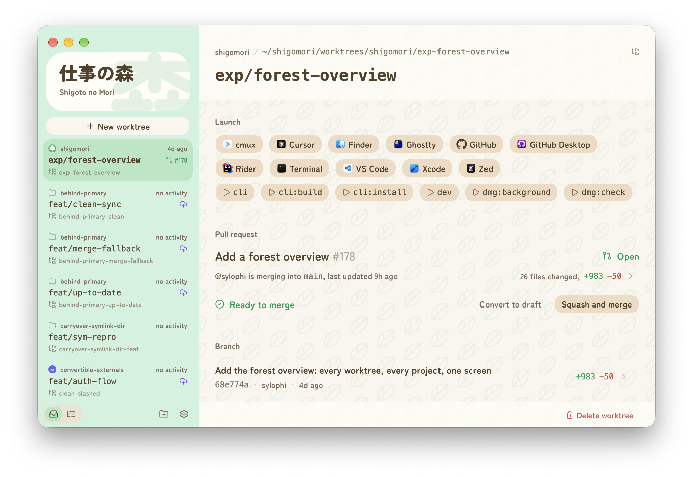

# Shigoto no Mori

A desktop app for managing many git worktrees in parallel.

Comes with a focused GUI and one-click launchers per worktree (editor, shell, agent CLI, anything configurable per project). Agent and platform-agnostic by design.



`Shigoto no Mori` plays on *Doubutsu no Mori* (Animal Crossing), "work forest", and the idea of a forest of worktrees: many pieces of work growing side by side without becoming chaos.

## Repository

| Folder | What it is |
| --- | --- |
| `app/` | The Electron desktop app and the web client (one pnpm project) |
| `cli/` | The `sm` CLI, a Go module bundled into the app |
| `file-sync/` | The worktree mirroring engine, a Go module bundled into the app |
| `hub/` | The device hub, a Cloudflare Worker with its own pnpm project |
| `skills/` | Agent skills for the `sm` workflow (below) |

Install the app's dependencies with `pnpm -C app install` (the root
`postinstall` script does the same). The root `package.json` forwards
the app's everyday scripts, so `pnpm dev` and `pnpm test` work from
either place. The repo-wide checks (`lefthook.yml`,
`.oxlintrc.json`, `.oxfmtrc.json`) stay at the root.

Each folder documents itself: [`app/README.md`](app/README.md) is the
app's layout, [`app/DESIGN.md`](app/DESIGN.md) its visual rules,
[`app/MANUAL-TESTING.md`](app/MANUAL-TESTING.md) how to run and drive
it by hand, and [`hub/README.md`](hub/README.md) the device hub.

## Agent skills

`skills/` holds instruction snippets that teach coding agents the `sm`
workflow (create a worktree, switch to one, land and clean up, tear one
down, register a project, send a worktree to another of your machines or
bring one over). Install with [Vercel skills](https://github.com/vercel-labs/skills)
(skills.sh); the installer lets you pick which ones to include:

```sh
npx skills add https://github.com/sylophi/shigoto-no-mori
```

## License

Shigoto no Mori is licensed under the MIT License. See [LICENSE](LICENSE).
