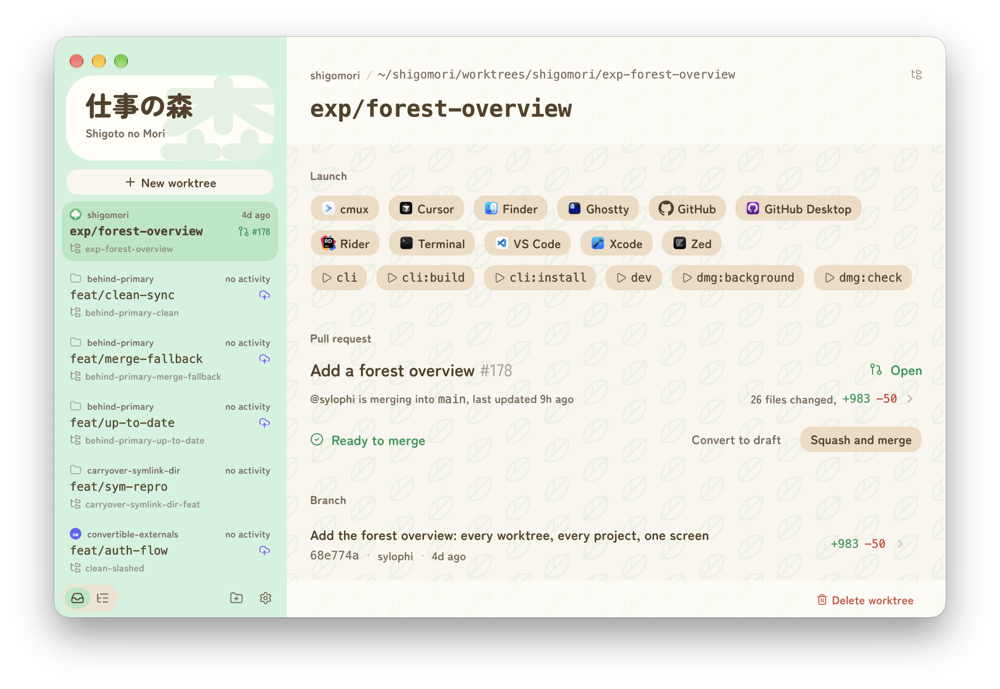

# Shigoto no Mori

A desktop app for managing many git worktrees in parallel.

Comes with a focused GUI and one-click launchers per worktree (editor, shell, agent CLI, anything configurable per project). Agent and platform-agnostic by design.



`Shigoto no Mori` plays on *Doubutsu no Mori* (Animal Crossing), "work forest", and the idea of a forest of worktrees: many pieces of work growing side by side without becoming chaos.

## Repository

| Folder | What it is |
| --- | --- |
| `app/` | The Electron desktop app and the web client |
| `hub/` | The device hub, a Cloudflare Worker |
| `marketing/` | The shigomori.com site, built with Astro |
| `lint/` | The repo's own oxlint rules, with their tests |
| `packages/` | The packages the v3 refactor moves code into (`contracts`, `engine`, `host`, `ui`, `cli`), each empty until its step (`V3.md`) |
| `cli/` | The `sm` CLI, a Go module bundled into the app |
| `file-sync/` | The worktree mirroring engine, a Go module bundled into the app |
| `macfs/` | The macOS filesystem calls Node lacks (clone, flags, xattrs, private size, filesystem type), a Go module bundled into the app |
| `skills/` | Agent skills for the `sm` workflow (below) |

The JavaScript packages are one pnpm workspace (`pnpm-workspace.yaml`)
with one lockfile: run `pnpm install` at the root, then
`pnpm run postinstall`. Install scripts are off, so that second command
is what runs the packages' own setup (the app's icons and its node-pty
helper). The workspace file
holds the supply-chain settings and the catalog that pins the versions
the packages share. The root scripts run the app's through pnpm filters
(`pnpm dev`, `pnpm test`), and `pnpm typecheck` runs every package's.
`pnpm -C <package> …` works too. The repo-wide checks (`lefthook.yml`,
`.oxlintrc.json`, `.oxfmtrc.json`, `knip.jsonc`) and their tools stay at
the root. `pnpm check` runs every check CI runs.

Each folder documents itself: [`app/README.md`](app/README.md) is the
app's layout, [`app/DESIGN.md`](app/DESIGN.md) its visual rules,
[`app/lab/README.md`](app/lab/README.md) how to test it by hand on the
real UI, [`app/test/README.md`](app/test/README.md) its programmatic
checks, [`hub/README.md`](hub/README.md) the device hub, and
[`lint/README.md`](lint/README.md) the repo's lint rules.

While the `release/v3` branch lives, [`V3.md`](V3.md) is its charter and
checklist and [`EFFECT.md`](EFFECT.md) the conventions every Effect
change follows.

## Agent skills

`skills/` holds instruction snippets that teach coding agents the `sm`
workflow (create a worktree, switch to one, name its branch and give it
a title and description, land and clean up, tear one down, register a
project, send a worktree to another of your machines or bring one over,
link to a worktree in the app). Install with [Vercel skills](https://github.com/vercel-labs/skills)
(skills.sh); the installer lets you pick which ones to include:

```sh
npx skills add https://github.com/sylophi/shigoto-no-mori
```

## License

Shigoto no Mori is licensed under the MIT License. See [LICENSE](LICENSE).
